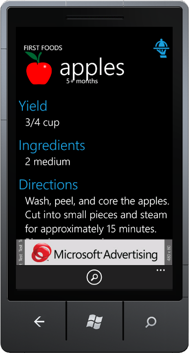
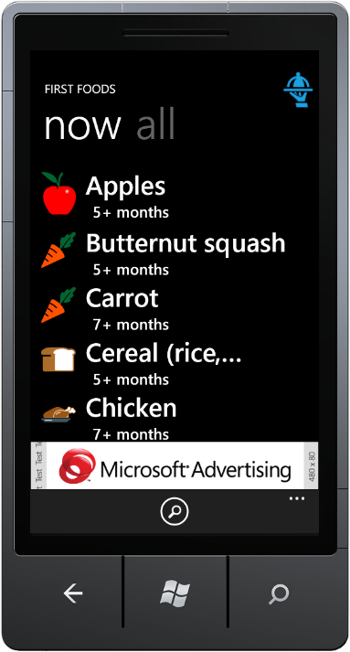
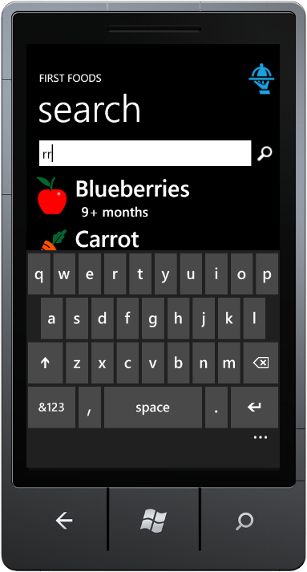

I've been playing around with Windows Phone development quite a bit lately.  I'm currently getting ready to submit my first application to the marketplace - "Baby's First Foods".

Babies under 1 year old can only eat certain foods depending on their age.  Each month new foods become available to the child.  It's hard to keep track of what foods your child is ready for and what foods should be avoided. That's the problem my app is trying to address.

Key features:

* Filtered List of foods your baby is ready to eat right now.
* Complete list of all foods, including the suggested baby age.
* Search functionality
* Preparation instructions

I think that these features represent the [Minimum Viable Product](http://en.wikipedia.org/wiki/Minimum_viable_product "Minimum Viable Product").  My plan is to base any further development on feedback I receive from users. I'm trying to break my usual habit of going feature crazy and never releasing anything.

Of course, I do have some ideas for additional features...

* Push notifications when your baby has become eligible to eat additional foods.
* Recipe ideas for mixing different foods together.
* Ability for the user to edit the food/recipe data.
* Like & dislike buttons on foods.
* Suggest foods based on likes & dislikes.

I think my first priority after release will be making the feedback mechanism as easy as possible, in hopes that I'll get more of it.

This was my first time using MVVM.  I found it difficult to do 'pure' MVVM on Windows Phone.  Initially that was due to a lack of Commands, but after the Mango update I found that most of my "Commands" were just page navigation.  I'd just assume have that in the code-behind.

Unit testing WP7 assemblies is painful...  Very painful.  The silverlight assemblies can only be executed on the device, so in order to run your unit tests you need to deploy the test application to the device/emulator and then run the tests on there.  The [Silverlight Unit Test Framework](http://archive.msdn.microsoft.com/silverlightut "Silverlight Unit Test Framework") has a built in 5 second countdown before it runs the tests.  All in all it takes around 20 seconds before my tests even begin to execute.  This increased cost makes me run my tests less frequently, which means I'm taking bigger steps, which means lower quality testing.

