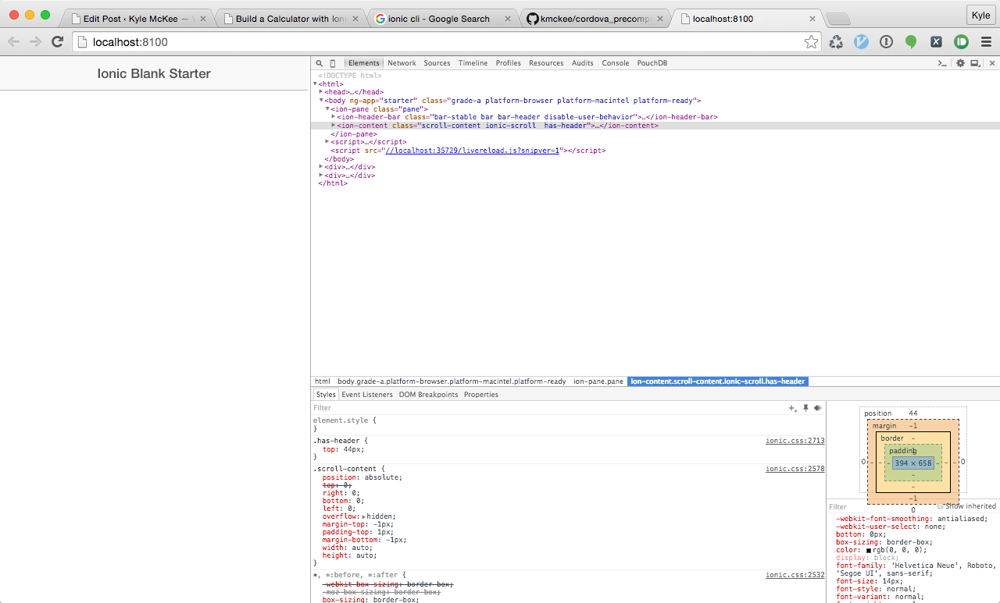
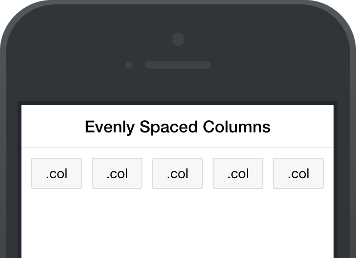
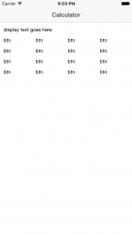
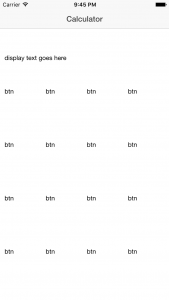
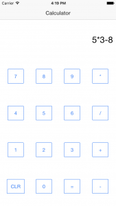

In this tutorial, we're going to build a basic calculator app using Ionic.  The calculator app is relatively simple, but you'll learn the following along the way:

* Ionic's grid system for layout
* Using other libraries in your app
* Basics of Controllers, Factories, Scope and Binding in Angular
* Using Ionic's icons (Ionicons)

Lets get to it.  

## Creating the Project

Cd into wherever you keep your code, and then create a new blank ionic app:

```bash

ionic start calculator blank
```

Next up, cd into the newly created calculator directory and get your first git commit in:

```bash

cd calculator
git init
git commit -am "Initial Commit"
```

Now let's send it to the simulator to make sure we've got a working walking skeleton.

```bash

ionic build ios
ionic run ios
```

At this point, you should see a blank app load up on the simulator.  


The simulator is great, but it takes a little longer than I'd really like when I'm making minor adjustments to the layout.  Luckily, there's a much faster way to get feedback.  Open up a new terminal and run this in the root of your project:

```bash

ionic serve
```

This will spin up a local web server that serves your app.  It will even automatically refresh in your browser when you make changes to the source files.  This is the kind of tight feedback loop that makes web development fun.

I recommend opening your dev tools on the right side, this gives you a phone shaped viewport for your app and plenty of space for your dev tools.



Open up www/index.html and change the H1 element's text from "Ionic Blank Starter" to "Calculator".  You should see the page immediately refresh in your browser and reflect the changes.  

## Grids

Ionic ships with a grid system that uses flexbox to make it really easy to lay things out.  All of the devices supported by Ionic/Cordova support flexbox, so even though it's a relatively newer feature in desktop browsers we're free to use it in this environment.  

The basic gist of the grid system is that you can apply css classes to specify which elements are rows and which are columns.  By default, column elements will expand evenly to fill their row.  It's similar to bootstrap's grid system if you're used to that, except you aren't forced into a 12 column layout.

So, this markup:

```html

<div class="row">
  <div class="col">.col</div>
  <div class="col">.col</div>
  <div class="col">.col</div>
  <div class="col">.col</div>
  <div class="col">.col</div>
</div>
```

Will look like this on a device:


You can also use the grid system to do row and column spanning, explicit percentage sizing of columns, and a bunch of other things.  For what we're doing, just knowing the above is enough.  If your interested in learning the other things you can do, check out the [Ionic Documentation for Grids](http://ionicframework.com/docs/components/#grid-explicit).

### Laying out the Calculator View

Thinking about our calculator, we need one row with a column that occupies 100% of the width for the calculator's display.  After that we need a grid composed of 4 rows, each containing 4 equal sized columns.

Play around with it and see if you can get it.  If you're stuck, take a peek at my solution below.
[showhide more_text="Show layout code" less_text="Hide layout code"]

```html

<div class="row">
  <div class="col">display text goes here</div>
</div>
<div class="row">
  <div class="col">btn</div>
  <div class="col">btn</div>
  <div class="col">btn</div>
  <div class="col">btn</div>
</div>
<div class="row">
  <div class="col">btn</div>
  <div class="col">btn</div>
  <div class="col">btn</div>
  <div class="col">btn</div>
</div>
<div class="row">
  <div class="col">btn</div>
  <div class="col">btn</div>
  <div class="col">btn</div>
  <div class="col">btn</div>
</div>
<div class="row">
  <div class="col">btn</div>
  <div class="col">btn</div>
  <div class="col">btn</div>
  <div class="col">btn</div>
</div>
```

[/showhide]

Our layout looks pretty good, horizontally, but vertically we want to get our grid to fill the entire viewport and also disallow scrolling.



Fixing the scrolling is simple, the ion-content directive has a scroll property that you can simply set to false.

Getting the vertical sizing is a little more difficult.  Ionic doesn't really support vertically sizing grids.  This makes sense, since 90% of the time you want your content to occupy as much vertical space as it needs and that's it.

Add these styles to www/css/style.css

```css

.fill-height {
    display: flex;
    flex-direction: column;
}

.fill-height > div.row {
    flex: 1;
}
```

...and then apply the fill-height class to the ion-content element.

```html

            <ion-content scroll="false" class="fill-height">
                <div class="row row-center">
                    <div class="col">5*3-8</div>
                </div>
                <div class="row row-center">
                    <div class="col">btn</div>
                    <div class="col">btn</div>
                    <div class="col">btn</div>
                    <div class="col">btn</div>
                </div>
                <div class="row row-center">
                    <div class="col">btn</div>
                    <div class="col">btn</div>
                    <div class="col">btn</div>
                    <div class="col">btn</div>
                </div>
                <div class="row row-center">
                    <div class="col">btn</div>
                    <div class="col">btn</div>
                    <div class="col">btn</div>
                    <div class="col">btn</div>
                </div>
                <div class="row row-center">
                    <div class="col">btn</div>
                    <div class="col">btn</div>
                    <div class="col">btn</div>
                    <div class="col">btn</div>
                </div>
            </ion-content>
```

...and voila!
]

## Buttons

Lets put some buttons on our grid.  We can use a standard button element for now, and just apply a few [Ionic button classes](http://ionicframework.com/docs/components/#outlined-buttons) to style it.

**There's a ton of duplication in here**, but for now it will do.  I also wrote a few styles to align things nicely.  At this point, our UI is pretty much done!

Here's the code I wound up with:

**www/css/style.css**

```css

/* These two classes are used to make the button
 * grid stretch vertically to fill the available
 * space
 */
.fill-height {
    display: flex;
    flex-direction: column;
}
.fill-height > div.row {
    flex: 1;
}

/* These two classes center the buttons in their
 * cells and right align the display text.
 * The second selector has a higher specificity,
 * so it overrides the centering.
 */
ion-content .col {
    text-align: center;
}
ion-content div.display {
    font-size: 2em;
    text-align: right;
}
```

**www/index.html**

```html

            <ion-content scroll="false" class="fill-height">
                <div class="row row-center">
                    <div class="col display">5*3-8</div>
                </div>
                <div class="row row-center">
                    <div class="col">
                        <!-- Look at all the duplication!  Css mixins or an
                             angular directive could help here. -->
                        <button class="button button-outline button-positive">
                            7
                        </button>
                    </div>
                    <div class="col">
                        <button class="button button-outline button-positive">
                           8 
                        </button>
                    </div>
                    <div class="col">
                        <button class="button button-outline button-positive">
                           9 
                        </button>
                    </div>
                    <div class="col">
                        <button class="button button-outline button-positive">
                           * 
                        </button>
                    </div>
                </div>
                <div class="row row-center">
                    <div class="col">
                        <button class="button button-outline button-positive">
                           4 
                        </button>
                    </div>
                    <div class="col">
                        <button class="button button-outline button-positive">
                           5 
                        </button>
                    </div>
                    <div class="col">
                        <button class="button button-outline button-positive">
                           6 
                        </button>
                    </div>
                    <div class="col">
                        <button class="button button-outline button-positive">
                           / 
                        </button>
                    </div>
                </div>
                <div class="row row-center">
                    <div class="col">
                        <button class="button button-outline button-positive">
                           1 
                        </button>
                    </div>
                    <div class="col">
                        <button class="button button-outline button-positive">
                           2 
                        </button>
                    </div>
                    <div class="col">
                        <button class="button button-outline button-positive">
                           3 
                        </button>
                    </div>
                    <div class="col">
                        <button class="button button-outline button-positive">
                           + 
                        </button>
                    </div>
                </div>
                <div class="row row-center">
                    <div class="col">
                        <button class="button button-outline button-positive">
                           CLR 
                        </button>
                    </div>
                    <div class="col">
                        <button class="button button-outline button-positive">
                           0 
                        </button>
                    </div>
                    <div class="col">
                        <button class="button button-outline button-positive">
                            =
                        </button>
                    </div>
                    <div class="col">
                        <button class="button button-outline button-positive">
                           - 
                        </button>
                    </div>
                </div>
            </ion-content>

```

And here's what it looks like:


In the next post, we'll wire up the behavior and get everything so it's actually working.

Other posts in this series:

* [Getting Started with Cordova](/getting-started-with-cordova)
* [Intro to Ionic](/intro-to-ionic)
* Build a Calculator with Ionic - Part 1 of 2
* [Build a Calculator with Ionic - Part 2 of 2](/build-a-calculator-with-ionic-2)