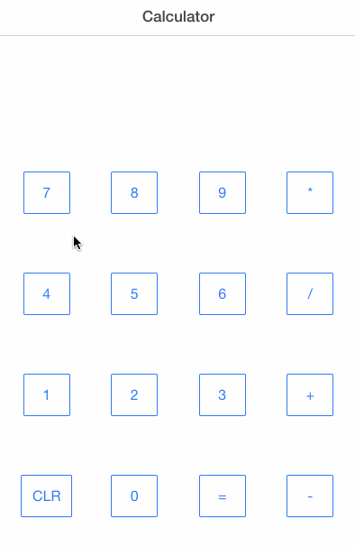
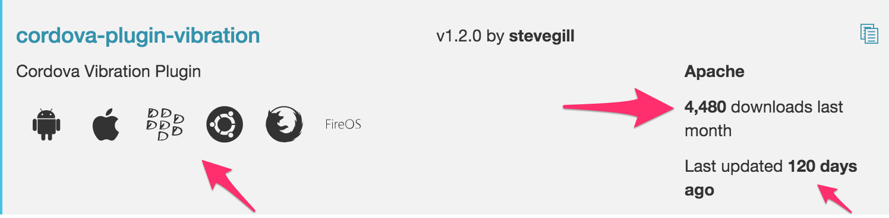

In the [previous post](/build-a-calculator-with-ionic-1), we made a pretty calculator that doesn't really do anything.  In this post, we'll be focused on making the calculator actually work.  

## Adding Behavior

Let's create a controller and get it associated with our view.  To start out with, let's get the clear button working.  We can expand from there, but that's probably the simplest place to start.

We'll need to create a controller to do this.  If you're not familiar with angular controllers, it won't stop you from completing this tutorial, but you'll definitely want to spend some time focusing on angular if you're planning to build more apps with Ionic after this.  

First, let's tell our view about our controller by adding the ng-controller attribute to the body element of our view.
**www/index.html**

```html

    <body ng-app="starter" ng-controller="CalculatorController">
       <!-- ... -->
    </body>
```

Next we'll wire the clear button's click event to a function that we're going to define in our controller:
**www/index.html**

```html

<button class="button button-outline button-positive" 
     ng-click="clear()">
    CLR 
</button>
```

Create a new file that will contain our CalculatorController:
**+ www/js/controller.js**

```js

angular.module('starter')
.controller('CalculatorController', function($scope) {
   $scope.clear = function () {
       alert('Clear!');
   };
});
```

A couple things worth noting: 

* The 'starter' string is the name of our root module, which is just the default module name that Ionic uses. You can change this to something more meaningful, but if you do you'll need to change it in app.js as well.
* $scope is the scope that our view will be bound to. At a basic level, this means that things we define on here will be visible when we're binding to stuff in the view.
* I'm just alerting in here for now, to make sure your controller is working and the view is able to bind to it. Baby steps.

Finally, don't forget to include the controller script!
**www/index.html**

```html

    <head>
        <!-- ... -->
        <!-- your app's js -->
        <script src="js/app.js"></script>
        <script src="js/controller.js"></script>
    </head>
```

With all that in place, you should be able to run your app and see the alert pop up when you click the button.  It's a start.

### More Behavior

Thinking about the buttons on the calculator, they only really do 3 different things.

* The = button does the computation and displays the result.
* The CLR button clears the display
* Everything else just appends the button's label to the display

Let's make the 3 functions and wire them up to our buttons.  

**www/js/controller.js**

```js

angular.module('starter')
.controller('CalculatorController', function($scope) {
   $scope.clear = function () {
       // TODO: Clear the display
       alert('Clear!');
   };

   $scope.clicked = function (label) {
       // TODO: Append the label to the display
       alert('clicked: ' + label);
   };

   $scope.equals = function () {
       // TODO: Calculate  & set the display to the result.
       alert('Equals!');
   };
});
```

**www/index.html**

```html

  <button class="button button-outline button-positive"
          ng-click="clicked('7')">
    7
  </button>
<!-- and so on... -->
```

One thing worth noting here, the clicked function requires that you pass an argument to it, and the clear and equals functions do not.  We should probably wrap these buttons up in a directive, but, not now.

### Changing the Display

We need to create a variable on our controller's scope that will contain the equation that's currently being displayed, and we want to bind that text to the display div.

First, lets create the variable on our scope.  Inside your controller function, add this line to initialize the variable on the scope:
**www/js/controller.js**

```js

angular.module('starter')
.controller('CalculatorController', function($scope) {
    // ...
    $scope.display = "";
    // ...
});
```

And, to bind this property to the content of our div we can use Angular's curly brace expression syntax:
**www/index.html**

```html

<!-- ... -->
            <ion-content scroll="false" class="fill-height">
                <div class="row row-center">
                    <div class="col display">
                        <span>{{display}}</span>
                    </div>
                </div>
                <!-- ... -->
            </ion-content>
<!-- ... -->
```

Angular treats anything in double curly braces as an expression and will evaluate it against the scope that's tied to your view.

Next we can update the functions on our controller to make them update the display.  Angular will automatically keep this in sync with our view.

**www/js/controller.js**

```js

angular.module('starter')
.controller('CalculatorController', function($scope) {
    // ...
    $scope.display = "";
    // ...
});
```

### Current State

It's starting to actually look like a calculator!  It can even accurately calculate the result of an infinite number of equations (<small>as long as they equal 100</small>).

Check it out:


This is another great place to throw down a git commit.

## Using a Third Party Library to Calculate

JavaScript has a fantastic community built around it, with tons of libraries available to do just about anything you can think of.  Ionic uses a tool called Bower to manage it's JS dependencies.  If you're familiar with pip (Python), NuGet (.NET), or Bundler (ruby) it's pretty similar.

When the user hits the "=" key, we could totally parse the expression and calculate the result.  Heck, we could probably even just eval it.  I'd rather use this as an opportunity to show you how you would go about including and consuming third party packages in your application, because this will be way more useful to you in the future than the other options.

[Searching in Bower's repository](http://bower.io/search/?q=epsilonjs), I found a package called EpsilonJS that looks like it will do exactly what we're after.

Open up your terminal in the root of your project, and install epsilon:

```bash

bower install epsilonjs
```

Next we need to include the epsilon script in our page:
**www/index.html**

```html

        <!-- cordova script (this will be a 404 during development) -->
        <script src="cordova.js"></script>

        <!-- Third party libraries -->
        <script src="lib/epsilonjs/build/epsilon.min.js"></script>

        <!-- your app's js -->
        <script src="js/app.js"></script>
        <script src="js/controller.js"></script>
```

Looking at the [documentation for EpsilonJS](https://github.com/kdinev/EpsilonJS), it looks like this will create a global Epsilon object.  Let's go ahead and use it directly from our controller for now. 

**www/js/controller.js**

```js

angular.module('starter')
.controller('CalculatorController', function($scope) {
    // ...
    $scope.equals = function () {
        var equation = $scope.display;
        var parser = new Epsilon.ExpressionParser(equation);
        var result = parser.evaluate();
        $scope.display = result;
    };
});
```

This code works, and it makes our calculator function pretty decently.  Play around with it and see for yourself.

### Extracting a Calculator Service

This is not a good pattern to follow, however, for a few reasons.  

* Our controller contains the knowledge of how to create the things it depends on (the expression parser). It's generally a bad idea to have a high level abstraction, such as a controller, have a downward pointing dependency on a lower level abstraction.
* Our controller is directly coupled to an external dependency. This isn't a huge deal since our app is so simple, but in a larger application you would want to encapsulate this coupling some place. If we had, say, two calculator controllers (Scientific vs simple maybe?), we wouldn't want both of their controllers to be coupled directly to this external API. When that API changes, we would have to fix it in 2 or more places.
* We can't test our controller logic separately from the third party library. This adds unneeded complexity to our controller tests.

We can address all of these concerns by wrapping epsilon in our own object and letting angular inject our new service into the controller.  We're now free to mock the controller in our tests if we choose, the controller doesn't know intimate details about the construction of it's dependencies, and we have a new object between our controller and the Epsilon library that will encapsulate our knowledge of how to use Epsilon.

This is, admittedly, a bit contrived for an app this simple.  However, you'll need to do this for larger applications.  So, let's do it for the practice.

Here's what I came up with:
**www/js/controller.js**

```js

angular.module('starter')
.controller('CalculatorController', function($scope, calculator) {
    // ...
    $scope.equals = function () {
        var equation = $scope.display;
        var result = calculator.calculate(equation);
        $scope.display = result;
    };
})
.factory('calculator', function() {
    var calculate = function(equation) {
        var parser = new Epsilon.ExpressionParser(equation);
        return parser.evaluate();
    };

    return {
        calculate: calculate
    };
});

```

I registered a factory function with angular that knows how to create a calculator object.  The calculator object encapsulates all knowledge of Epsilon, and would theoretically allow us to swap out our calculator library without having to change the rest of our app.  Notice on line 2 that the calculator is being passed into the controller by Angular.  Angular matches the factory name with the parameter name and injects the dependency for you.

## Using Cordova Plugins

Cordova Plugins can be used to give you access to native functionality that you wouldn't normally be able to use from a web application.  They do this by injecting a javascript api into the dom that is able to talk to native code using the Cordova Bridge.  Most of that is transparent to you as a consumer of the plugin, really all that you need to know is that when you install a plugin it will create a javascript api that lets you do things you couldn't normally do from JavaScript.

So, let's make the device vibrate when the user hits equals.  More gold plating, but with a purpose! :)

A [quick search on the Cordova Plugin Registry](https://cordova.apache.org/plugins/?q=vibration) shows one promising looking plugin:  

I highlighted a couple things you'll want to keep an eye on when searching for plugins.  

* Does the plugin support all of the devices you're targeting? This one supports quite a few.
* How many other people are using the plugin? The more the merrier, you're less likely to find issues with it.
* How recently was the plugin updated? Some older plugins may not be supported anymore, you'll want to think carefully before taking on a dependency on something like this. What happens when new devices are released and they don't work with your plugin?

I also like to open the GitHub repository for any plugins I'm considering to see how healthy they look over there, and also check out their documentation and see if I'll be able to figure out how to use the it.

### Adding the Plugin

Make sure you've done a git commit, then tell Ionic to add the plugin:

```bash

ionic plugin add cordova-plugin-vibration
```

Next, let's invoke the vibrate function in our controller when we hit equals:
**www/js/controller.js**

```js

    $scope.equals = function () {
        // ...
        navigator.vibrate(500);
    };

```

Next up, you'll need to deploy to a device to test it out (the simulator and your web browser can't vibrate):

```bash

ionic run ios --device
```

And that's it!

Other posts in this series:

* [Getting Started with Cordova](/getting-started-with-cordova)
* [Intro to Ionic](/intro-to-ionic)
* [Build a Calculator with Ionic - Part 1 of 2](/build-a-calculator-with-ionic-1)
* Build a Calculator with Ionic - Part 2 of 2