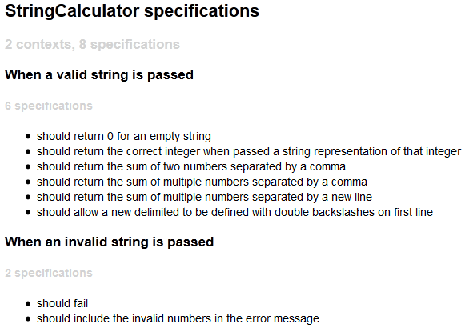

I used to think that writing more comments increased the readability of my code, but I've come to realize that **comments frequently hurt readability**. That might sound a little trollish, but here's why I think it's true:

* Comments allow you to stop refactoring prematurely.
* Comments aren't kept up to date.  It's really easy for this to happen because the association between a comment and the related code is very weak.
* Comments that explain what code is doing are a [DRY](http://en.wikipedia.org/wiki/Don't_repeat_yourself "Don't Repeat Yourself") violation.  Your code should do that.
* Frivolous commenting devalues your meaningful comments.  Your reader's attention is a scarce resource - don't waste it!

So, in my mind, the question really becomes "_What is the best way to make this code easier to understand?_"

# Method Names

When I see a comment that summarizes what the next few lines of code is doing, my first reaction is to extract that code into a new method and use the comment to name my method.

I prefer a method name because the relationship between a method and it's implementation is much stronger than the relationship between a comment and it's related code.  A method name, by definition, tells you something meaningful about the behavior of the code contained within it.  It has a clearly defined scope.  A comment is just a statement within your code.  It has no scope, and is only weakly related to 'nearby' code.  Vertical spacing can be used to help define 'nearby', but it's still very subjective.

If you're adding a line of code into some existing code there's no tangible connection between what you're changing and a comment that appears 15 lines before it.  _It's not natural to search backwards for a comment that may or may not exist._

However, if you were adding a line of code to a short method it's much easier to make the connection.  _It's natural to think "Does this method still do what it says it's doing?"_

Method names also have much higher visibility than comments.  Every time someone calls your method, they're forced to type out your method name.  Consumers of your method are essentially forced to acknowledge your name.  A method name is visible from both the caller and the callee, while a comment is only visible from one or the other.

# Unit Tests Reduce Comment Dependence

Well written unit tests do a fantastic job of documenting your code.  Unit tests provide executable documentation of how your code behaves under different scenarios.  While someone might alter the behavior of a method and forget to update a comment, they're guaranteed not to forget to update a unit test because it will fail.  For this reason, unit tests are more likely to provide accurate documentation of behavior than comments.

Unit tests also provide centralized documentation.  Rather than having comments that explain behavior strewn all around the code, you're encouraged to document them consistently and put them in one place.  If you're writing your tests in a BDD style, you can even have it generate some fancy output that describes your objects.

Take a look at this MSpec output that's generated by my tests:

This output was generated from tests I wrote while working on Roy Osherove's [String Calculator Kata](http://osherove.com/tdd-kata-1/).  Every line in this output is backed by a test.  I can say with a fair amount of certainty that these statements are accurate and will remain so.

# Good Comments?

All code tells you how it's doing something.  Well written code makes it easy to understand what it's doing.  It isn't always intuitive why you might need to do something, though.  Comments are great for explaining **why**.

Triple slash comments in C# are useful if you're creating an API that's going to be consumed by someone else.  I wouldn't expect the person using my API to have any familiarity nor any desire to become familiar with my code or my unit tests.  I'm willing to sacrifice being DRY and summarize what my code does in a comment at this point because it provides a better experience for the person consuming my API.

In general, if my own code is the only consumer of a method I don't write triple slash comments.  This forces me to keep my method names clear and avoids duplicating intent.

# Final Thoughts

The next time you're writing a comment, stop and ask yourself why.  Could you refactor the code so you don't need it?  Should it actually be a unit test?  Does it add enough value to offset the cost of someone having to read it?

Comments are not the goal.  Clarity is.

## Comments from WordPress

*  **Tim Smelser** 2014-12-15T22:11:14Z
  > I was going to leave a comment ... but I didn't want to hurt the readability of your blog.