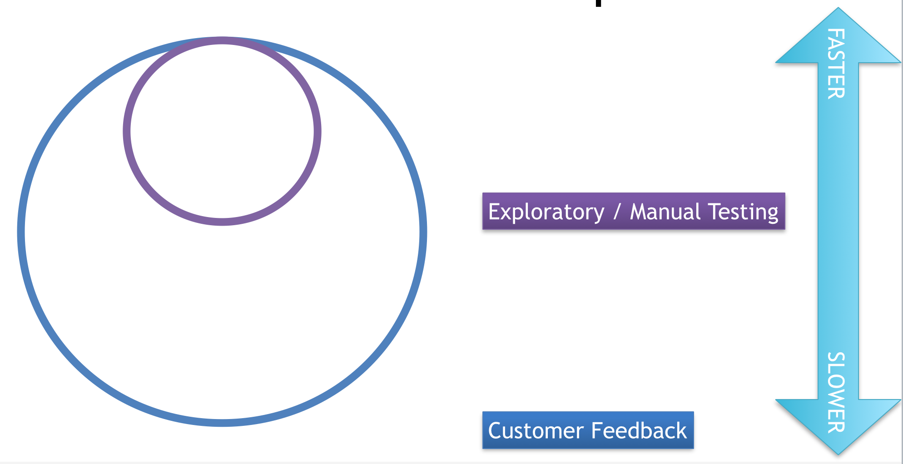
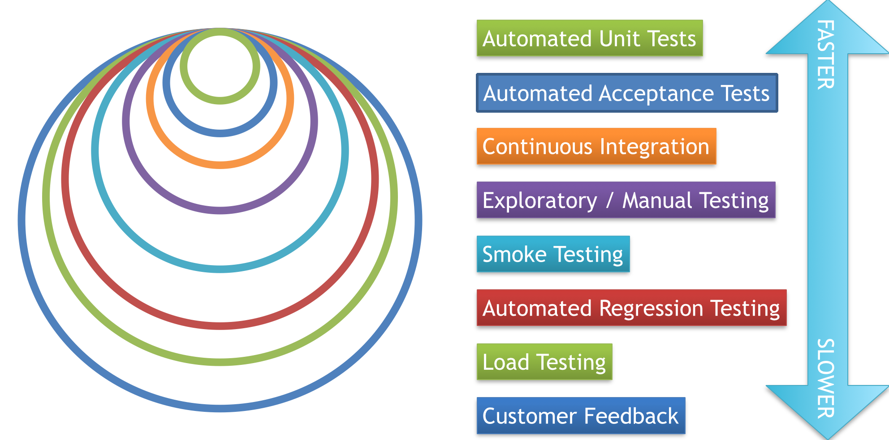

Building great software is all about feedback.  

The faster you're getting feedback about what you're building, the better the decisions you'll make about what to build next.  

Traditionally, software teams have only really had a couple of feedback loops: 

The smaller loop here is feedback from manual / exploratory testing.  The larger loop is slower feedback from your customers.  If you want to be able to embrace changing requirements (and you should), you won't be able to do it well without better feedback.

Here's what a better model might look like:

Embracing change on development projects is not possible without also changing your engineering practices to support it.