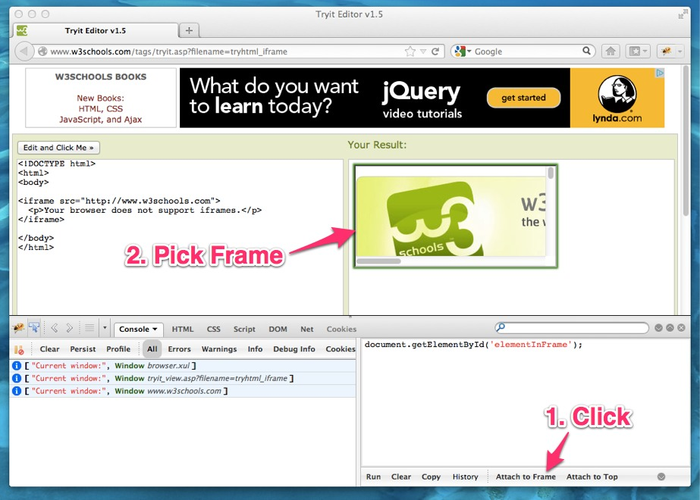

## The Trouble with IFrames and Firebug

I'm a huge fan of Firebug.  I tend to write most of my UI-centric Javascript right in the Firebug console so that I can run it and immediately see the results.  After I'm satisfied with the code I've written I'll cut it out of Firebug's console and paste it into its permanent home.  This probably isn't the most efficient workflow, but it works well for me because it provides really fast feedback.

If you use the Firebug console a lot, like me, you've probably run into issues when you're interacting with pages that use IFrames.  The console attaches to the top window, so any code you run via the command line is run only in that context.  You could manually drill down through any frames on the page like this:

```js
var someElement = document.getElementById('someFrame').document.getElementById('someElement');
```

That's pretty ugly, and if you're planning to actually use the code you're writing in the console you'll need to run through it all and remove all the code that drills down through the frames.  I'll pass.

## Attaching to Frames with cd(window)

Firebug has a built in command that can attach the console to a different window:

```js
cd(document.getElementById("someFrame").contentWindow);
// Now, all script will be run in the context of that frame.
var someElement = document.getElementById('someElement');
cd(top);  // Attach the console back to the top window.
```

That's a lot better than manually drilling down through any frames, plus my code isn't going to be littered with useless frame references this way. Of course there are still a couple other problems:

* You have to type that big cd(...) line every time you want to switch contexts.
* You need to remember the name or index of the frame you want to attach to.
* If you have multiple levels of nested frames (...don't ask) it can be tedious and time consuming to drill down through them.

## Enter FireIFrame

The solution I came up with was to extend Firebug by adding a button that would allow the user to visually select a frame on the page to attach the console to.  Here's what it looks like in action:



If you'd like to try it out can [download it directly](https://addons.mozilla.org/en-US/firefox/addon/fireiframe/ "FireIFrame Download Page") or just search for it in the extension manager.  Source code is available on [GitHub](https://github.com/kmckee/FireIFrame "FireIFrame GitHub page").

I think I could extend this further to also include a "Frames" tab that displays a graphic representation of all the frames on a page, indicates which one the console is currently attached to, and allows inspector style navigation to each frame in the HTML panel.