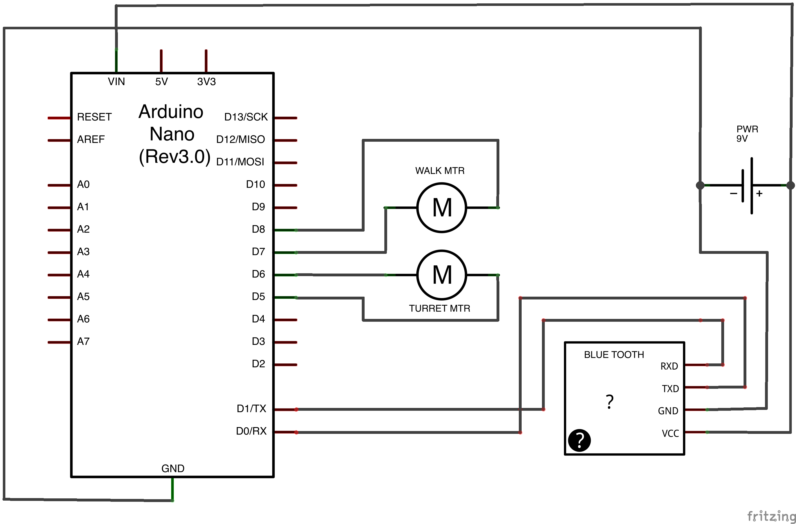

I found one of these little [HEXBUG Hexbug Spider](http://www.amazon.com/gp/product/B004HL0A12/ref=as_li_tf_tl?ie=UTF8&camp=1789&creative=9325&creativeASIN=B004HL0A12&linkCode=as2&tag=aptobits-20) on Amazon and thought it might be fun to try and hook an Arduino up to it.  It's about the size of a fist and is controlled by an infrared remote control.

The robot's movement is controlled by two small servos.  The first servo causes the top of the robot to rotate 360 degrees without moving the feet.  The second servo causes the legs to move.  The legs are mechanically linked to the top of the robot in such a way that the robot will always walk in the direction that the top of the robot is facing.

Here's a video of my hacked HexBug in action:
`youtube:https://www.youtube.com/embed/fc8a2T5FpLU`

After opening up the robot I was able to use a multimeter to probe the leads running up to the motors and determine that they're operating at about 3.3v.  Since the Arduino Nano's digital IO pins are 3.3v when high it made this a really simple project.

Wiring Schematic:

Note that the RXD line on the Bluetooth Shield is connect to TXD on the arduino, and TX goes to RX. I wasn't able to pair with the device for quite some time, and eventually the person I was pairing with figured out I wired that up backwards.

The code I wrote to control everything is [available on GitHub](https://github.com/kmckee/spider_bot).
