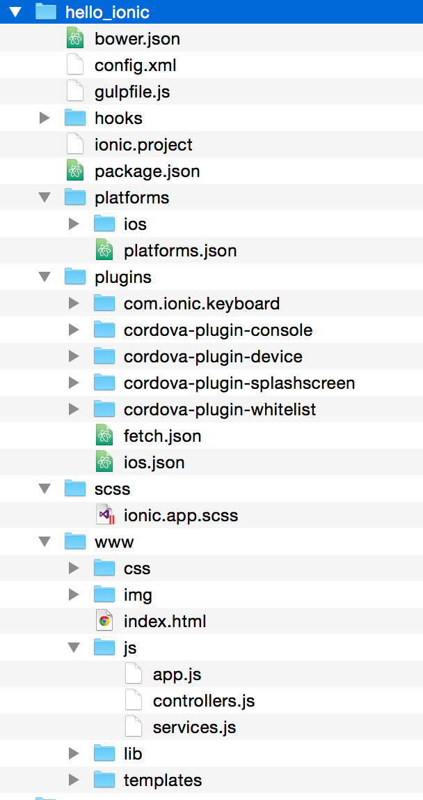
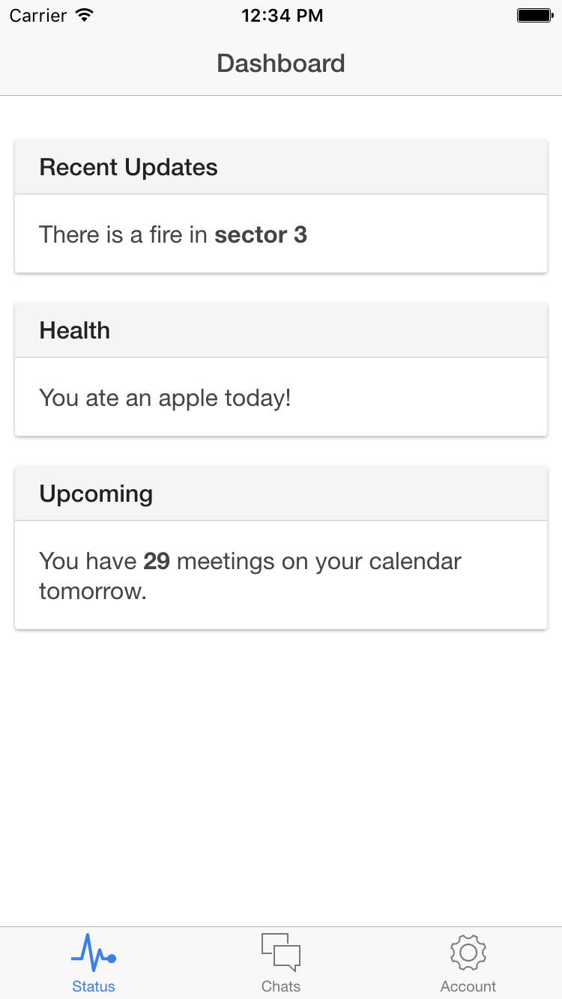

Now that you've mastered all things Cordova in the [previous blog post](/getting-started-with-cordova), let's take a look at Ionic and see where that fits in.  

## What is Ionic?

Ionic sits on top of Cordova and provides some excellent CSS and JavaScript components that are perfect for building mobile apps.  Ionic also ships with a couple of templates that demonstrate how to do common mobile UX patterns and provide a great starting point for a lot of apps.  

## Installing Ionic

Assuming you've set up Cordova already, the only thing you need to do is globally install the ionic node module:

```shell
npm install -g cordova ionic
```

## Create an Ionic App

To create a new Ionic app, you'll want to cd into whatever directory you keep your projects and run this ionic start command, passing in the directory name you would like to create the project in and which starter template you would like to use.

```shell
cd ~/code/
ionic start hello_ionic tabs
```

In this example, we created an ionic app inside the ~/code/hello_ionic that starts with a simple tab based layout.  The basic structure of this application is very similar to what we're already familiar with from a basic Cordova app, except now there's a bunch of extra Ionic goodies in there.  One other thing worth noting is that Ionic will automatically add the iOS platform for you if you're on a mac, whereas with Cordova you don't have any platforms by default.

Let's take a look at what this created for us.


#### config.xml

The config.xml holds metadata about your project, the plugins that it uses, and preferences that are applicable to one or more of the platforms that you support.  This is no different from a regular Cordova app.

#### hooks\

Hooks are an extensibility point that can be used to define custom functionality.  You can write custom scripts and wire them into Cordova to be run at different points in time.  Ionic creates a hook by default, but other than that this is really no different from a regular Cordova app.

#### platforms\

Your Cordova project can be deployed to one or more different device platforms (iOs, Android, Windows Phones, etc).  If you're on a mac, you'll find an iOS platform directory contained in here by default.  Other than that, this is no different from a regular Cordova app.

#### plugins\

Cordova features a plugin system to allow you to add support for different functionalities.  If, for example, you want to use the device's camera, you could add a plugin that would expose the functionality to do so to you through a JavaScript API exposed to you.  By default, Ionic will add a few plugins that help to standardize behavior across different platforms.  You don't really need to know much about them for now, just know that they're there.

#### www\

This is where most of your application code will live.  The index.html page contained in this directory is the entry point for your application.  All other assets that your web application needs, including CSS, HTML, javascript, and images should be contained in this directory.  No different from a regular Cordova app.

#### Bower

Ionic sets up Bower you control your client side dependencies.  If you're not familiar with Bower, then for now just know that bower is there and if you wanted to add a client side dependency like, say, jQuery or something like that you would use Bower to do so.

#### Gulp

Ionic also sets you up with a gulpfile and a few tasks in there.  If you're coming from a ruby background, gulp is roughly equivalent to rake.  It's used to create tasks that can be invoked at a command line.  Usually you'll see it used to do things like minification, obfuscation, compiling of SASS and things like that.  

#### SASS

Ionic uses SASS for it's CSS.  SASS stands for Syntactically Awesome StyleSheets.  It's a superset of CSS and can be compiled down to plain old CSS using a gulp task that Ionic creates.

#### app.js, controllers.js and services.js

Finally time for some Angular!  App.js defines the root module, which is 'starter' by default, and it also contains all of your app's routing information.

Controllers.js contains the definitions for, you guessed it, all of our app's controllers.  Out of the box the tabs template contains four controllers for each of the different views the app could be in (one for each tab view, plus one for a detail view of an chat list item).

Services.js contains a simple little factory function definition that returns a mock service that's used to generate some of the data used by the chat views.

It's probably a good idea to break apart the 'controllers.js' and 'services.js' files into separate files.  In general, it's a bad idea to structure angular apps this way.  You want to group things together around domain concepts, not what design pattern the objects conform to.

## Git

It's a good idea to get a commit in at this point, just in case things get squirrelly.  

```shell
git init
git commit -am "First commit, vanilla ionic app"
```

## Deploying to the iOS simulator

Lets go ahead and run our app on an iOS simulator (assuming you're on a mac).  Open up a terminal in the root of your project and run the following command:

```shell
ionic emulate ios
```

If you're following along at home and everything went well, you should see the iOS simulator spin up at this point and load an app that looks like this:


## Conclusion

As you can see, Ionic added quite a bit of stuff over a vanilla Cordova app.  However, it's given us a lot in return.  Out of the box we have a pretty nice looking app that will scale to all different device sizes and we avoid a lot of the device specific quirkiness that we'd run into if we were creating this from scratch.  Not bad!  Next up, we'll dig deeper into Ionic to understand how it's working and get us to a point where we can start confidently making changes to it.

Other posts in this series:

* [Getting Started with Cordova](/getting-started-with-cordova)
* [Intro to Ionic](/intro-to-ionic)
* [Build a Calculator with Ionic - Part 1 of 2](/build-a-calculator-with-ionic-1)
* [Build a Calculator with Ionic - Part 2 of 2](/build-a-calculator-with-ionic-2)