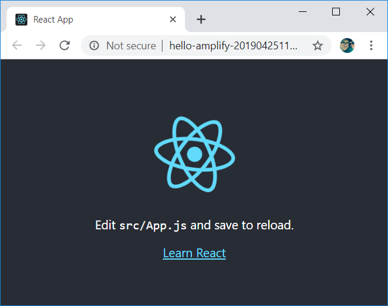

> A Walking Skeleton is a tiny implementation of the system that performs a small end-to-end function. It need not use the final architecture, but it should link together the main architectural components. The architecture and the functionality can then evolve in parallel.
> Alistair Cockburn

This article will guide you through the creation of a walking skeleton for a React + GraphQL based application that's running Serverless on AWS. We'll use a new cli tool from the AWS team called "Amplify" to streamline the configuration and set up of everything and get us going.

Amplify is a CLI tool from AWS that provides a simple and effective abstraction over a lot of AWS services. Here are a few use-cases to give you an idea for what you can do with it:

- Need to get your React app to the cloud? `amplify add hosting && amplify publish` and you're all set.
- Want to add a GraphQL backend for it? `amplify add api && amplify publish` and it's online.
- Also, if you requested it, your React app will now include generated code to help you interact with that shiny new GraphQL endpoint.

Now that you have an idea for where all of this is headed, let's dig into the details and try it out.

## Installing Amplify

Install and configure the Amplify CLI:

```bash
npm install -g @aws-amplify/cli
amplify configure
```

You'll be guided thru a relatively straightforward process to get the CLI connected to your AWS account.

If you need more guidance, I'd be hard pressed to beat the [existing installation & setup docs](https://aws-amplify.github.io/docs/).

## Creating a React App new

Pop open a terminal and run your standard CRA command to create a React app named "helloamplify"

```bash
npx create-react-app helloamplify
cd helloamplify
```

At this point you could run your React app locally by running `yarn start`.

## Publishing a React App with Amplify

First, we'll need to add the dependency to our package.json file:

```bash
yarn add aws-amplify
```

Next, we need to get amplify initialized before we can start configuring our hosting.

```bash
amplify init
```

At this point you're going to be prompted to answer a few questions about your project. I like to name the environment "dev", and aside from that you can accept defaults for every other question.

### Adding Hosting

Let's tell amplify that we'd like it to host our application.

```bash
amplify add hosting
```

For our purposes go ahead and select the "Dev (S3 Only with HTTP)" option, and then defaults are fine for everything else.

### Publishing

Now that we've configured the hosting, all that's left to do is deploy our current application. That's simple enough:

```bash
amplify publish
```

In a few moments, your web browser will pop up with your freshly deployed application.



Cool! That's a React app hosted by AWS with minimal work. Best of all, someone else can close this repo and run a few commands to deploy it in their own environment. All of the configuration that we've done is included in a few new files that will be under source control.

Let's have a look at them before we add our GraphQL API.

## Deployment Configuration is Under Source Control 🙌

Check your `git status` out and spend a few minutes taking a look at the contents of these newly created files.

```bash
$ git status
On branch master
Changes to be committed:
  (use "git reset HEAD <file>..." to unstage)

        modified:   .gitignore
        new file:   amplify/.config/project-config.json
        new file:   amplify/backend/backend-config.json
        new file:   amplify/backend/hosting/S3AndCloudFront/parameters.json
        new file:   amplify/backend/hosting/S3AndCloudFront/template.json
        new file:   amplify/team-provider-info.json

```

There are also some files in the amplify folder that are specific to just you, and not the rest of your team, so those files were added to the .gitignore file.

Once you've satisfied your curiousity, go ahead and `git commit` and we'll move ahead with adding our GraphQL API.

## Adding a Serverless GraphQL API

GraphQL is a big topic unto itself, but if you're not familiar I'll give you the bare minimum you need to start using it here. You'll definitely want to dig into the docs and try out some tutorials specific to it as you go deeper.

Using a GraphQL client and a GraphQL server together will allow you to move data back and forth between your client and your server. You've probably done this with REST in the past. With GraphQL we will have a single endpoint to interact with (as opposed to REST's approach of multiple endpoints per resource), and we'll have a ton more control over the shape of the data.

Let's add that API now -

```bash
amplify add api
# ...
? Please select from one of the below mentioned services GraphQL
? Provide API name: helloamplify
? Choose an authorization type for the API API key
? Do you have an annotated GraphQL schema? No
? Do you want a guided schema creation? Yes
? What best describes your project: One-to-many relationship (e.g., “Blogs” with “Posts” and “Comments”)
? Do you want to edit the schema now? No
# ...
```

After adding the API, you'll have a new file that defines your API's schema:

`amplify/backend/api/helloamplify/schema.graphql`

```graphql
type Blog @model {
  id: ID!
  name: String!
  posts: [Post] @connection(name: "BlogPosts")
}
type Post @model {
  id: ID!
  title: String!
  blog: Blog @connection(name: "BlogPosts")
  comments: [Comment] @connection(name: "PostComments")
}
type Comment @model {
  id: ID!
  content: String
  post: Post @connection(name: "PostComments")
}
```

Amplify went ahead and generated a sample schema file for us that's the classic Blog application. The `@model` annotation is used to identify your top level object types that will be stored in an Amazon DynamoDB table, and the `@connection` annotation is how you configure relationships between them. Annotations can also be used to configure things like authentication and indexing by other services like Elasticsearch.

We will keep the default schema for now. Let's deploy it!

```bash
git add . && git commit -m "Added GraphQL API"
amplify publish
```

Select defaults for all the options, and notice that we asked the publish command to generate some code for us. When the command finishes, your API is now live!

Next, we'll get our React app to actually use our API to display and mutate the data that's stored in our API. Also, this is a great point for a `git commit`.

## Connecting React and GraphQL using Amplify

We have a front-end and we have a back-end, but they've never met eachother. It's time to fix that so we can complete our walking skeleton and see data moving back and forth.

Install the `aws-amplify` package with yarn so that we can use their GraphQL client:

```bash
yarn add aws-amplify
```

Let's simplify our schema a bit. Edit `amplify/backend/api/helloamplify/schema.graphql` so that it contains only the following:

```graphql
type Comment @model {
  id: ID!
  content: String
}
```

Once that's been updated, you'll need to redeploy our app:

```bash
amplify publish
```

Open up `src/index.js` and add these two lines:

```jsx
import React from "react"
import ReactDOM from "react-dom"
import "./index.css"
import App from "./App"
import * as serviceWorker from "./serviceWorker"
import Amplify from "aws-amplify" //highlight-line
import aws_config from "./aws-exports" // highlight-line
Amplify.configure(aws_config) // highlight-line

ReactDOM.render(<App />, document.getElementById("root"))

// If you want your app to work offline and load faster, you can change
// unregister() to register() below. Note this comes with some pitfalls.
// Learn more about service workers: https://bit.ly/CRA-PWA
serviceWorker.unregister()
```

The `aws-export.js` file was generated by Amplify as a convenience. It contains information about your local publish settings and is not kept under source control. You'll probably want to use environment variables instead once you have CI and multiple environments you're deploying to. For now, let's keep using it.

### Basic React Setup

Open up `App.js`. We're going to create a simple form that will create new `Comment`s for us using a graphql mutation.

Replace the `App` component with the following:

```jsx
import React, { Component } from "react"

export default class App extends Component {
  constructor() {
    super()
    this.state = {
      current: "",
      allComments: [],
    }
  }
  setCurrent = e => this.setState({ current: e.target.value })
  createComment = () => {
    const newComment = { content: this.state.current }
    const comments = [newComment, ...this.state.allComments]
    this.setState({ current: "", allComments: comments })
    console.log("TODO: Actually save the new comment!")
  }
  render() {
    const { current, allComments } = this.state
    const commentListItems = allComments.map(c => (
      <li key={c.id}>{c.content}</li>
    ))
    return (
      <div className="App">
        <input type="text" onChange={this.setCurrent} value={current} />
        <button onClick={this.createComment}>Create</button>
        <ul>{commentListItems}</ul>
      </div>
    )
  }
}
```

### Queries

We'll next use the `componentDidMount` lifecycle method to make it so that our `App` component will run a graphql query to fetch all the comments from our GraphQL endpoint.

Add this method to your `App` component:

```jsx
import React, { Component } from "react"
import { API, graphqlOperation } from "aws-amplify" // highlight-line
import { listComments } from "./graphql/queries" // highlight-line

export default class App extends Component {
  // ...
  componentDidMount() {
    API.graphql(graphqlOperation(listComments)).then(res => {
      console.log(res)
    })
  }
  // ...
}
```

Of course, we _could_ run `amplify publish` to push this up to the cloud, but we need faster feedback for local development. Run `yarn start` instead to spin up your React app locally. It will still communicate with your deployed GraphQL endpoint on AWS (because that's what we specify in our `aws-exports.js` file).

The response should look like this:

```json
{
  "data": { "listComments": { "items": [], "nextToken": null } }
}
```

It might not look like much, but this is a successful response from our backend. We don't have any comments yet, so there's an empty array coming back.

Let's update our state when the Promise resolves:

```jsx
  componentDidMount() {
    API.graphql(graphqlOperation(listComments)).then(res => {
      this.setState({ allComments: res.data.listComments.items });
    });
  }
```

### Mutations

We'll next use a GraphQL mutation to create a comment. Mutations are similar to queries, but they're going to actually change data on the server. Amplify generated some helper code for us in the `src/graphql/mutations` file that we'll use to get us going:

```js
createComment = () => {
  this.setState({ current: "" })
  const newComment = { content: this.state.current }
  API.graphql(graphqlOperation(createComment, { input: newComment })).then(
    res => console.log("Created it! Here is the response", res)
  )
}
```

Run the app, add a comment and you should see.......**nothing**. Refresh the page, however, and you should see your comment appear.

The problem is that we're telling the server to create that new comment, but nothing is ever updating things client side. We _could_ manually add the newComment to our local state, but we don't know the `id` of the comment since that's generated on the backend.

Furthermore, if another user were to add a new comment it would be awesome if it showed up on every user's list of comments. Turns out, we can achieve all of this using a GraphQL Subscription.

### Subscriptions

We'll need to subscribe to the creation of comments, and then unsubscribe when we're done listening.

```jsx
// ...
import { onCreateComment } from "./graphql/subscriptions" // highlight-line

export default class App extends Component {
  // ...
  componentDidMount() {
    // highlight-start
    this.subscription = API.graphql(
      graphqlOperation(onCreateComment)
    ).subscribe({ next: data => console.log(JSON.stringify(data)) })
    // highlight-end

    API.graphql(graphqlOperation(listComments)).then(res => {
      this.setState({ allComments: res.data.listComments.items })
    })
  }
  componentWillUnmount() {
    this.subscription.unsubscribe() // highlight-line
  }
  // ...
}
```

Go ahead and create an item, and your subscription should send back some data that looks like this:

```json
{
  "provider": {
    // ...
  },
  "value": {
    "data": {
      "onCreateComment": {
        "id": "d1a0a0b3-10b8-4766-b100-0ce1a5242982",
        "content": "asdfasdfasdfasdf",
        "__typename": "Comment"
      }
    }
  }
}
```

Let's go ahead and pop that into the top of our list in local state:

```jsx
  componentDidMount() {
    this.subscription = API.graphql(
      graphqlOperation(onCreateComment)
    ).subscribe({
      next: data => {
        const newComment = data.value.data.onCreateComment;  // highlight-start
        this.setState({ allComments: [newComment, ...this.state.allComments] }); // highlight-end
      }
    });
    // ...
  }
```

Of course, the coolest thing about this is that you can now open your application in two different browsers and watch as items added in one browser are immediately shown in the other browser. Pretty cool stuff!

## Conclusion

> A Walking Skeleton is a tiny implementation of the system that performs a small end-to-end function. It need not use the final architecture, but it should link together the main architectural components. The architecture and the functionality can then evolve in parallel.
> Alistair Cockburn

We've built a walking skeleton. We have a tiny implementation that can read, write, and listen to data. We've linked together the main architectural components in a meaningful way, and we're now ready to begin evolving and the remaining functionality of the application.

Maybe I'll write about that next.
