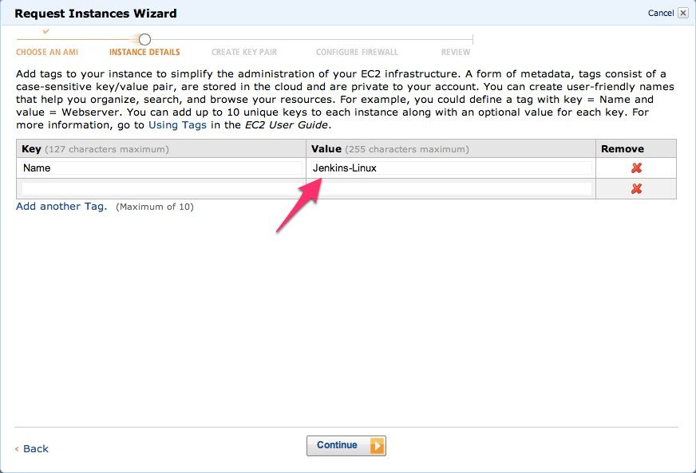
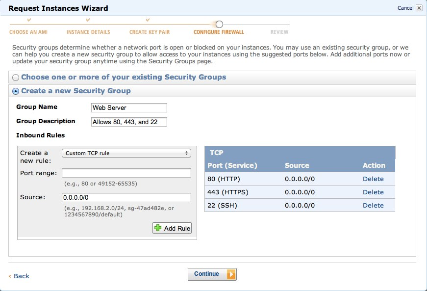
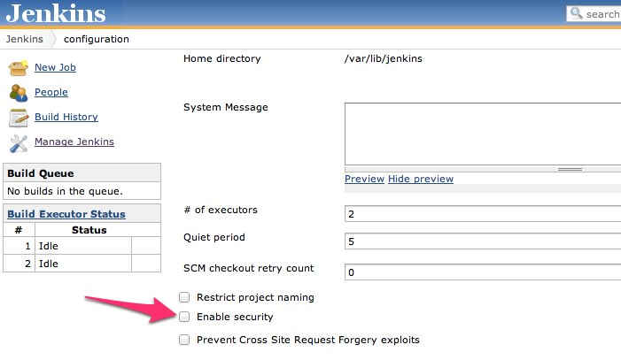
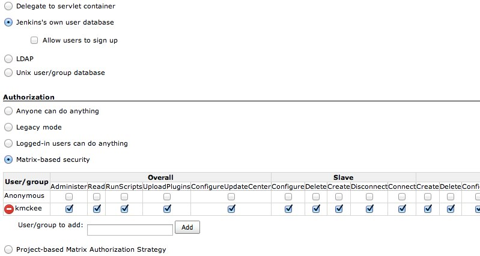

Amazon Elastic Compute Cloud (Amazon EC2) is a web service that provides resizable compute capacity in the cloud. In this post I'm going to document my steps creating an EC2 instance and setting up a Jenkins CI server on it.  I'll assume limited familiarity with Amazon EC2, Linux, and Jenkins.

## Spinning up an EC2 Instance

You'll need to sign up for Amazon's EC2 service on the [Amazon Web Services](http://aws.amazon.com "Amazon Web Services") site if you haven't already.  After that you can head over to your [EC2 Console](https://console.aws.amazon.com/ec2/ "EC2 Console") and select "_Launch Instance_".  Select the Classic Wizard, then "_Ubuntu Server 12.04 LTS_" and leave it on 64-bit.  Accept the defaults on the next three screens, and then add a value for the Name tag.



These tags will show up in your EC2 console later on, so it's helpful to give this a good name.

At this point you should be on the Create Key Pair screen.  Click create a new key pair if you don't already have one, enter a name, and then download the file.  Save it some place close to your home directory because you'll need to type the location to this file into a terminal later.

You'll need to create a new security group.  Be sure to allow HTTP, HTTPS and SSH:



Click Launch, wait for the green light and you're all set!

## SSH to the Instance

Amazon will complain about the file permissions on your key file, so we'll need to open up a terminal and make your key private before we can connect:

```shell
chmod 400 ~/.ec2/kmckeeKey.pem
```

Right click the instance in your EC2 console and select _Connect._ Expand the "_Connect with a Standalone SSH client_" node, and copy the code snippet that's in there to your clipboard.   Paste that into a terminal but don't commit it yet.  You'll need to update the .pem file parameter to point to wherever you saved your key file.  Also, change the "root" to "ubuntu".  So it should actually look something like this:

```shell
ssh -i ~/.ec2/kmckeeKey.pem ubuntu@ec2-XX-XXX-XX-XXX.us-west-2.compute.amazonaws.com
```

Run that command in terminal, and if all goes well you should be connected to your instance.

## Install nginx

nginx, pronounced Engine-X, is a lightweight web server/reverse proxy that we're going to use to proxy port 80 over to port 8080 (which is what Jenkins runs on by default).  You might be able to skip this and just change Jenkins to run on port 80, but we're going to do it with nginx.  Why not?

Install and start nginx:

```shell
sudo apt-get install nginx
sudo /etc/init.d/nginx start
```

At this point you should be able to hit your EC2 instance from a browser and get back a page from nginx.  Jump back into the EC2 console, select your instance and grab the Public DNS URL to try it out.

## Install Jenkins

```shell
wget -q -O - http://pkg.jenkins-ci.org/debian/jenkins-ci.org.key | sudo apt-key add -
sudo sh -c 'echo deb http://pkg.jenkins-ci.org/debian binary/ > /etc/apt/sources.list.d/jenkins.list'
sudo aptitude update
sudo aptitude install jenkins
```

## Start it!

```shell
sudo /etc/init.d/jenkins start
```

## Configure nginx as a Reverse Proxy

We've already installed nginx, but now we need to jump back and configure it to act as a reverse proxy.  Any requests coming in on port 80 should be routed through to 8080 so that Jenkins handles them.

## Open up the config file in vi

```shell
sudo vi /etc/nginx/nginx.conf
```

If you're not sure how to edit a file with vi, check out this [tutorial](http://www.arekdreyer.com/articles/crash-course-on-running-the-vi-editor).

Modify the config file to match what I have below (adding the server definition right before the end of the http):

```nginx
http {

        # ...Omitted for clarity...

        include /etc/nginx/conf.d/*.conf;    # This line not modified.
        include /etc/nginx/sites-enabled/*;  # This line not modified.

        ##
        # Reverse proxy port 80 to port 8080 for Jenkins
        ##
        server {
                listen 80 default;
                server_name ec2-XX-XXX-XX-XXX.us-west-2.compute.amazonaws.com;
                server_names_hash_bucket_size: 128;
                location / {
                        proxy_pass http://127.0.0.1:8080;
                }
        }
}  # This line not modified.
```

The syntax of this configuration file looks a little bizarre (what's up with the slash near the opening curly brace?), but we're not getting into the weeds here.

Restart nginx:

```shell
sudo /etc/init.d/nginx restart
```

Open up a browser and hit your site again.  You should see Jenkins!

## Lock it down

At this point your site is public and there's really nothing preventing someone coming and messing around on your server.

From your Jenkins dashboard, go to Manage Jenkins > Configure System.
Check the "Enable Security" check box that's hiding out near the top of the page.



Set your Security Realm to "Jenkins's own user database" and disable "Allow users to sign up".  Under Authorization, select "Matrix-based security".

Next we're going to grant rights to your user name (even though we haven't created the user yet - we'll do that next).  Enter your desired username in the "User/group to add:" textbox and click add.  Grant yourself all permissions in the matrix and you're all set.  There's a nice little shortcut button on the far right that you might need to side-scroll for.



Click the Save button, it will prompt you to create a new user, and you should be all set to start creating jobs.

### Comments from WordPress

*  **Kim G** 2013-06-03T10:34:40Z
  > Awesome!!!
*  **dave** 2013-08-11T13:07:08Z
  > great tutorial. everything worked for me, except:
  > 
  > 
  > 
  > server_name_ needs to be:
  > 
  > server_name ec2-XX-XXX-XX-XXX.us-west-2.compute.amazonaws.com
  > 
  > 
  > 
  > Also, I had to add server_names_hash_bucket_size: 128
*  **Kyle McKee** 2013-08-30T02:43:06Z
  > Thanks Dave, I updated the post based on your feedback.
*  **[jesus gollonet](http://jesusgollonet.com)** 2013-10-15T22:08:31Z
  > I just tried this and it almost worked right away, so thanks!
  > 
  > One comment:
  > 
  > Dave's proposed line should read
  > 
  > 
  > 
  > server_names_hash_bucket_size 128;
  > 
  > 
  > 
  > (i.e., no colon), and it should be outside the server declaration. It actually appears in /etc/nginx/nginx.conf with a default value of 64 directly inside the http group
*  **[Daniel](http://google.se)** 2014-07-30T21:43:34Z
  > Hi,
  > 
  > 
  > 
  > Agree with the comments above, it was a really great tutorial. However, I ran into an issue when following it to the point.
  > 
  > 
  > 
  > Using: 
  > 
  > "listen 80 default;"
  > 
  > 
  > 
  > Gave me this error when trying to restart nginx:
  > 
  > 2014/07/30 21:33:55 [emerg] 5387#0: a duplicate default server for 0.0.0.0:80 in /etc/nginx/nginx.conf:79
  > 
  > nginx: configuration file /etc/nginx/nginx.conf test failed
  > 
  > 
  > 
  > However, replacing it with:
  > 
  > "listen 80;"
  > 
  > 
  > 
  > As suggested here:
  > 
  > https://wiki.jenkins-ci.org/display/JENKINS/Jenkins+behind+an+NGinX+reverse+proxy
  > 
  > 
  > 
  > Solved the issue for me. 
  > 
  > 
  > 
  > Again, great tutorial!
  > 
  > 
  > 
  > /Daniel
*  **Edwaed** 2015-01-09T19:46:03Z
  > it doesn't work((
  > 
  > i got: ubuntu@ip-172-##-##-##:~$ sudo /etc/init.d/jenkins start
  > 
  >  * Starting Jenkins Continuous Integration Server jenkins                                                                                                                                            [ OK ] 
  > 
  > 
  > 
  > and no access from:  ec2-XX-XXX-XX-XXX.us-west-2.compute.amazonaws.com:80
