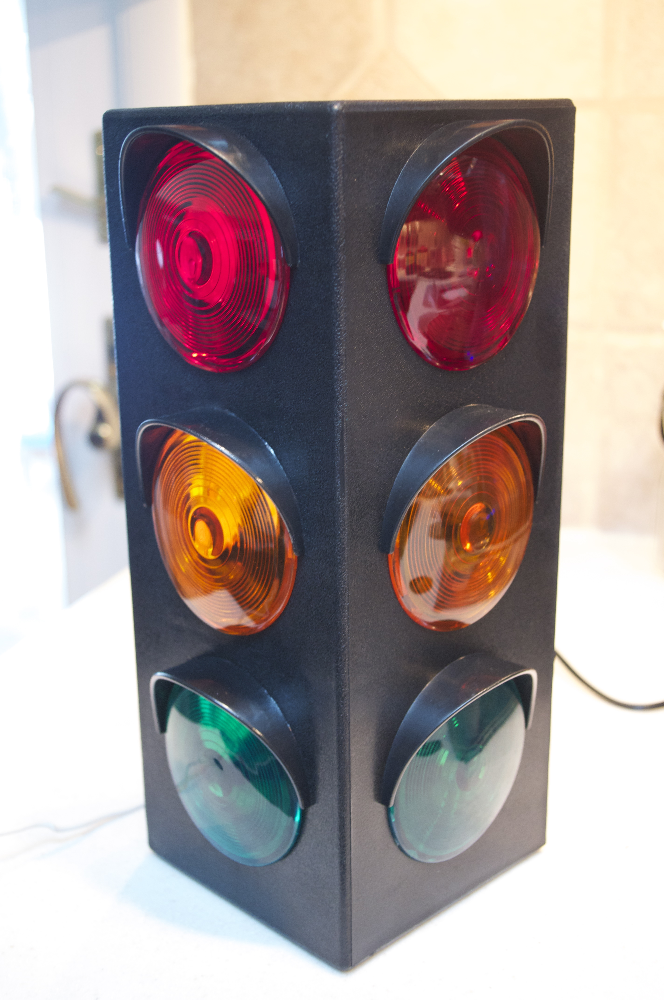
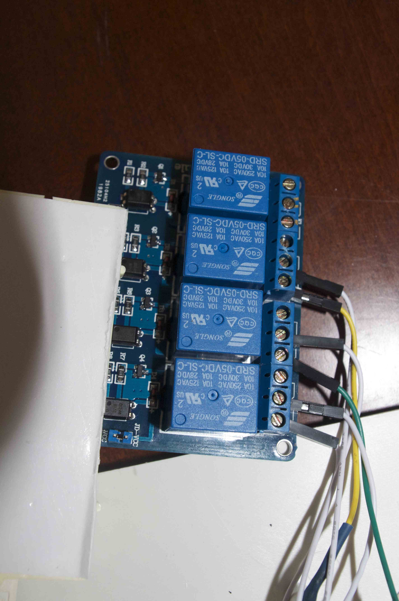
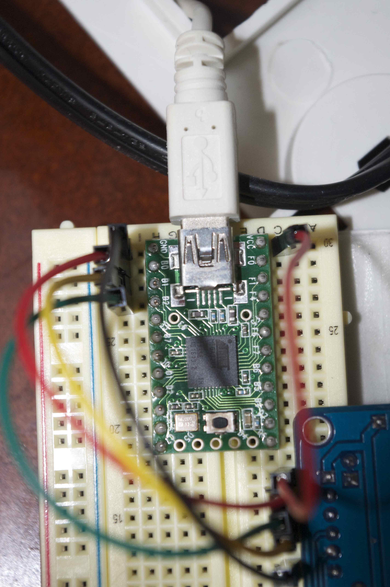
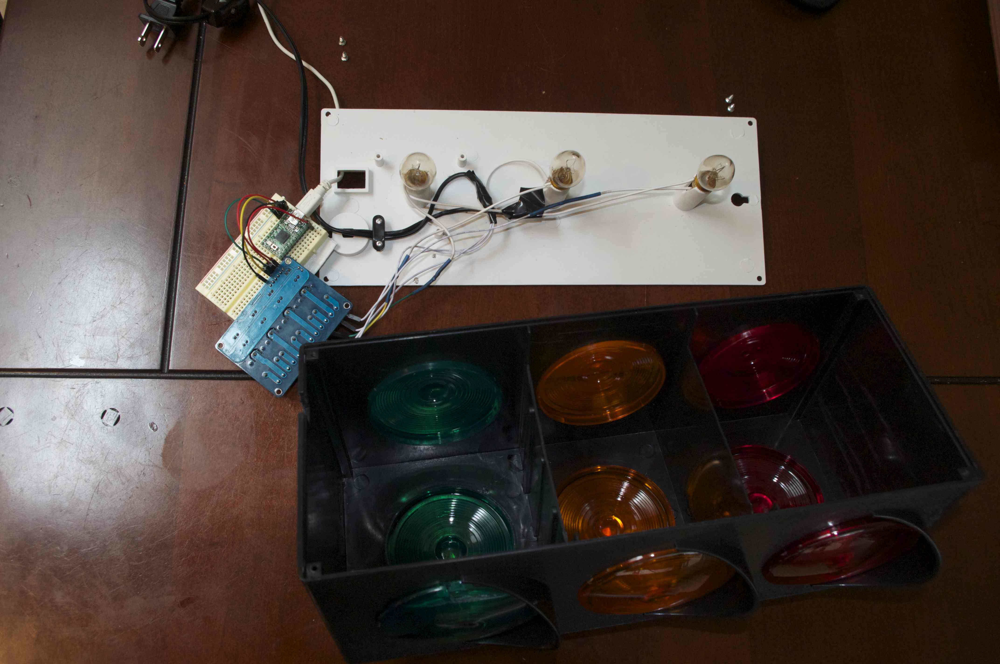

Continuous integration is great, but it's only as effective as the visibility of the build status.  You can use things like email notifications or [Hudson Tray Tracker](http://code.google.com/p/hudson-tray-tracker/ "Hudson Tray Tracker") to help increase the visibility, but I wanted something physical that could radiate the current build status.  Something everyone could see; even while you're grabbing a cup of coffee.  So, I decided to try and make a traffic light build indicator.

## Shopping List

* [Teensy 2.0 (with pins)](http://www.pjrc.com/store/teensy_pins.html "Teensy 2.0 (with pins)") - $19
* [Breadboard and some wires](http://www.amazon.com/microtivity-400-point-Experiment-Breadboard-Jumper/dp/B004RXKWDQ/ref=sr_1_5?ie=UTF8&qid=1357508413&sr=8-5&keywords=breadboard) - $9
* [4 channel relay](http://www.amazon.com/SainSmart-4-Channel-Relay-Module-Arduino/dp/B0057OC5O8/ref=sr_1_1?s=electronics&ie=UTF8&qid=1357508534&sr=1-1&keywords=relay+arduino) - $9
* Light bulbs - $4 (Home Depot / Lowes)
* [Large Blinking Traffic Light](http://www.amazon.com/gp/product/B003N3RJDW/ref=oh_details_o03_s00_i00) - $20

Total: $61

## Light

When you turn the light on each of the lights will flicker randomly.  I was a little surprised when I opened the light that there wasn't really much in there.  All three of the lights are wired up in series and connected straight to the power source.  It turns out the light bulbs have a thermal switch inside of them that causes them to flicker on and off.  The first thing you'll want to do is replace those bulbs with some regular bulbs.  Next up, go ahead and cut all the positive lines that join the bulbs together.  You'll need to make the positive leads a little longer and hook each of them up to the relay.  Connect the positive line from the power cord into each of the relays.

Drop the Teensy into the breadboard and hook B0, B1, and B2 up to the relay.  B0 should be connected to the input that drives the red relay, B1 is yellow, and B2 is green.  Hook VCC and GND up to the relay as well and you're done wiring.

I used some two sided tape to secure the teensy to the bottom of the traffic light. You might also need to drill a hole in the back of the light so you can hook up a USB cable to the Teensy.

Here's what the whole thing looks like:

Connect the Teensy to your computer and use Arduino to deploy the [Teensy Light Controller sketch](https://github.com/kmckee/JenkinsTrafficLight/blob/master/TeensyLightControllerSketch/TeensyLightControllerSketch.ino "Teensy Light Controller Sketch") to the device.  After the firmware is on the device you can use the serial monitor feature in Arduino to test out the wiring.  If you send a "1" to the device it should turn on the red light.  Sending a 2 will turn on yellow, 3 is green.  5, 6, and 7 will turn off each of the lights.  The relay makes a nice clicking noise when a light is toggled.

## The Console App

At this point you can turn the lights on and off by writing some integers to a serial port.  I threw together a console application that will poll a Jenkins server and push values to the light.  It's on GitHub - [go fork it](https://github.com/kmckee/JenkinsTrafficLight).

### Comments from WordPress

*  **Kamal Sharma** 2013-08-13T13:47:32Z
  > HI,
  > 
  > 
  > 
  > I was going through your light indicator and found it interesting so I am trying it out..I have a question regarding Arduino and USB board, how do you connect the USB board to the Arduino board, I am thinking of using the Ethernet board, Which Arduino did you used for this project?  Just not sure the link between USB board and Arduino how they will get connected and interact to each other?  
  > 
  > 
  > 
  > From what I understood you are using the USB board to activate and deactivate the relays so what is arduino used for?
  > 
  > thanks for the feedback..
*  **Kyle McKee** 2013-08-30T02:38:48Z
  > Hi Kamal,
  > 
  > 
  > 
  > There isn't a separate USB board for this.  The tiny little board that you can see plugged into the breadboard is a teensy, which is like a slimmed down cheap version of an arduino.  The other board with the big blue boxes on it is the relay, which is what controls the AC current for the light.  
  > 
  > 
  > 
  > So, the overall flow is like this:  There's an app running on the PC that's writing data to a USB port on the pc.  The Teensy is listening for these messages on it's USB port.  When it receives one, it writes HIGH or LOW to the appropriate pins to drive the separate relay board.  The relays open and close, and that controls the AC current that powers the actual lights themselves.
  > 
  > 
  > 
  > Hope this helps.  Thanks for posting!
